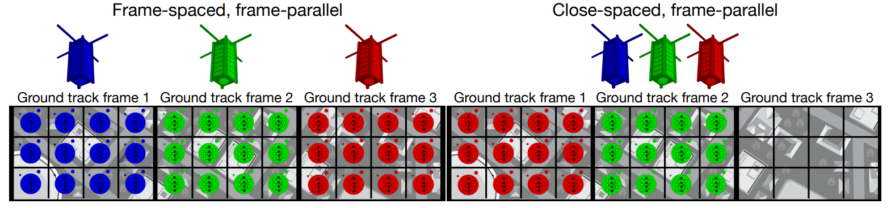

# Q&A

> 星地弯管架构中，管道深度的含义以及作用？

对于`csfp-base`而言，`pipeline depth`对应于卫星的数量。该仿真会创建与管道深度等量的卫星，然后对其执行任务进行仿真（模拟太阳能电池充电，诸如相机等能源消耗装置耗电的能源过程）。仿真会将相机拍摄并读出（`read-out`）的事件记录到log文件中，也就是`event-chamgr-*-readout-gtf-*.csv`。后续分析仿真结果的时候，会分析该事件的数量，并将其和`GTF`的数量求比例，获取覆盖率。并由此覆盖率得出合适的卫星数量（以保证能够完全覆盖所有的`GTF`）。也就是说，该仿真旨在获取四种卫星编排方式下最合适的，或者说最小的管道深度。这里的管道深度其实就等价于参与工作的卫星数量。

对于`sim-cs`等针对上下行链路的仿真，则更多地关注地面站的数量，使用的是真实的卫星模型（数量是固定的，详见`/artifacts/sim-common/sat/`下这三个`*-planet.data`，`*-spacex.dat`，`*-spire.dat`这三个文件，文件中有一个叫做`count`的field，制定了在三种卫星（planet, spacex, spire）的数量）这三种卫星的TLE文件请见同目录下的`planet.tle`，`spacex.tle`和`spire.tle`。在`note/README.md`中有对于这部分的详细说明。

> 论文以及仿真是否有提到星间链路（包括星间链路带宽设计等等）？通信仿真中的通信参数可否用于星间链路？如果将通信过程的地面站改成卫星，仿真可行吗？（因为研究的最终目标是实现星间链路）

+ 仿真似乎没有提及`星间链路`，也没有相关链路带宽设计和参数。仿真可能主要涉及对上下行链路的仿真，以及对于GTF拍摄任务的执行的仿真。对于后者，可能卫星群之间没有紧密的联系，相对独立。在该仿真中，卫星只是执行拍摄任务，并将拍摄好的图像转移给Jetson处理（可能最后通过下行链路再将数据传递回地面站，但是这部分仿真只是统计了相机readout图像的事件用于计算覆盖率，未涉及太多通信相关的逻辑）。

  + 通信仿真的通信参数会被代入香农公式计算出极限通信比特率，并以此通信比特率进行仿真。我认为将通信仿真中的通信参数是可以用于星间链路的。在仿真中，只要创建上行链路或者下行链路都会创建一个对应的Channel。这个Channel会使用`comsim::Receive` 和 `comsim::Transmit`作为参数，这两者中包含了通信的各类参数，可用于后续代入香农公式计算最大的通信比特率。这部分请看`/artifacts/sim-cs/source/close-spaced.cpp`中：

    ```c++
    downlinks.push_back(
        comsim::Channel(
            satId2Tx[SAT_ID],gndId2Rx[GND_ID],8.15e9,20.0e6,&dateTime,&log
        )
    );
    ```

    `Receive`和`Transmit`所用到的参数在`README.md`中有说明，会通过一些配置文件生成并读入。

    以及`software/comsim/channel/source/Channel.cpp`中（70-75行）：

    ```c++
    this->maxBitsPerSec = util::calcMaxBitsPerSec(
        this->transmit->getPower(), this->transmit->getLineLoss(),
        this->transmit->getGain(), this->atmosphericLossFactor,
        this->receive->getGain(), this->centerFrequencyHz, this->rangeKm,
        this->systemNoiseTemperatureK, this->bandwidthHz
    );
    ```

    会计算最大通信比特率。`util::calcMaxBitsPerSec`位于`software/comsim/utilities/source/utilities.cpp` 675行：

    ```c++
    uint64_t calcMaxBitsPerSec(
        const double& txPowerW, const double& txLineLossFactor,
        const double& txGainFactor, const double& atmoLossFactor,
        const double& rxGainFactor, const double& centerFreqHz,
        const double& rangeKm, const double& systemNoiseTempK,
        const double& bandwidthHz
    ) {
        const double C =
            txPowerW*txLineLossFactor*txGainFactor*atmoLossFactor*rxGainFactor*
            std::pow(
            (cnst::WGS_84_C/centerFreqHz)/(4.0*cnst::PI*rangeKm*cnst::M_PER_KM),2.0
        );
        const double N = cnst::BOLTZMANN_CONSTANT*systemNoiseTempK*bandwidthHz;
        return bandwidthHz*std::log2(1.0+C/N);
    }
    ```

  + 如果将通信过程的地面站改成卫星，仿真应该是可行的，将地面站的RX或者TX替换成卫星的RX和TX就行，可以复用Channel。比如原来是`comsim::Channel(gndTx, satRx, ...)`，现在都是星间通信，所以可以换成`comsim::Channel(satTx, satRx, ...)`。在仿真中，会通过以下方式记录上行链路和下行链路的数据量：

    ```c++
    for(size_t i=0; i<downlinks.size(); i++) {
        log.meas(
            comsim::LogLevel::INFO,
            dateTime.toString(),
            std::string("downlink-Mbps"),
            std::to_string(
                static_cast<double>(downlinks.at(i).getBitsPerSec())/1.0e6
            )
        );
        log.meas(
            comsim::LogLevel::INFO,
            dateTime.toString(),
            std::string("downlink-MB"),
            std::to_string(
                (1.0*static_cast<double>(downlinks.at(i).getBitsPerSec())/8.0)/1.0e6
            )
        );
        log.meas(
            comsim::LogLevel::INFO,
            dateTime.toString(),
            std::string("downlink-tx-rx"),
            std::to_string(downlinks.at(i).getTransmit()->getID())+"-"+
            std::to_string(downlinks.at(i).getReceive()->getID())
        );
    }
    ```

    这里的downlinks都是Channel类型。对于星间链路，我觉得也可以通过此方式输出log，以便后续进行分析。

> 仿真中有无体现几种遥感拍摄模式的区别？以及算法代码中是否有针对在何时用什么模式拍摄进行研究。

+ 仿真中有体现几种遥感拍摄模式的区别：

  在均为`close-spaced`的情况下，`tp(tile-parallel)`以及`fp(frame-parallel)`分别采用了如下的任务分配方式：

  + tp（见`artifacts/cstp-base/source/cstp-base.cpp`）：

    ```c++
    // For CSTP, a subset of tasks are claimed
    jobPtr->claimTasks(
        ciPtr->getWorkerId(),
        std::ceil(
            static_cast<double>(tasksPerJob)/static_cast<double>(pipelineDepth)
        )
    );
    ```

    分配给相机的任务数量为 `tasksPerJob / pipelineDepth`。

  + fp（见`artifacts/csfp-base/source/csfp-base.cpp`）

    ```C++
    // For CSFP, all tasks are claimed
    jobPtr->claimTasks(ciPtr->getWorkerId(), tasksPerJob);
    ciPtr->addClaimedJob(jobPtr);
    ```

    分配给相机的任务数量为 `tasksPerJob`。

  这恰好对应于论文中的这幅图：

  

  `cs(close-spaced)`和`fs(frame-spaced`的差距则主要体现于：

  1. 卫星物理空间上的布局：均以`fp(frame-parallel)`这一编排方式为例：

     `cs`的话卫星是紧挨着的，在代码中体现于（见`artifacts/csfp-base/source/csfp-base.cpp`）：

     ```c++
     // Orbit: 400 km altitude polar orbit (93 min period = 5580.0 sec)
     // For CSFP, all satellites are at the same radial position (0.0)
     satsim::Orbit orbit(5580.0, 0.0);
     
     //...
         
     // Push back new energy harvesting satellite
     ehsatellites.push_back(new satsim::EHSatellite(orbit, ehsystem, &logger));
     ```

     外面是一个pipelineDepth大小的循环，即创建管道深度等量的卫星，并且认为所有的卫星都在轨道的同一点。

     而对于`fs`而言（见`artifacts/fsfp-base/source/fsfp-base.cpp`）：

     ```c++
     // Orbit: 400 km altitude polar orbit (93 min period = 5580.0 sec)
     // For FSFP, satellites are separated in radial position
     // 一开始先创建一个卫星，而后每经过一个frame就加入一个新的卫星，直到卫星总数达到pipelineDepth
     satsim::Orbit orbit(5580.0, 0.0);
     
     // if the back satellite is past the initial ground track frame
     // then add the next satellite if the pipeline hasn't been finished
     if(ehsatellites.size()<pipelineDepth &&
        ehsatellites.back()->getOrbit().getPosn()>=radPerGtf) {
     	// ...
         // Push back new energy harvesting satellite
         ehsatellites.push_back(new satsim::EHSatellite(orbit, ehsystem, &logger));
     }
     ```

     `cs`是一开始就创建了pipelineDepth个卫星，而fs则是卫星每经过一个frame就加入一个新的卫星，直到卫星总数达到pipelineDepth。

	对应于论文中的这幅图：

	

+ 仿真是针对四种编排方式各做了实验并对比四种编排方式的覆盖率，得出使用哪一种能够用最少的卫星实现最高的覆盖率的结论。可见论文中的`Figure 8`：

  
   
  但是并未对应该在何种情况下使用某种编排方式进行说明和研究。或许仿真所追求的情况也就是使用卫星数量尽可能少的情况。

> “可以将纳米卫星组成的星座作为一个分布式系统，构成一个计算管道”。除了计算资源，其他资源（例如遥感资源、通信资源等等）是否也被算作为一个管道存在，并且在仿真过程中，计算资源体现在？有没有针对如何筛选拍摄数据进行回传展开仿真（即星上原始数据如何处理）？

+ 其他资源，理论上也可以作为pipeline。但是这个项目他的pipeline并没有体现的特别清楚，pipeline更多地倾向于表示参与工作的卫星的数量，而没有体现管道传递数据
的这一特性。即，卫星主要是在自己的组件间获取、传递数据（相机拍摄完之后，Jetson从相机Ready的图像中获取并进行处理），而没有涉及星间信息或者任务的传递。

+ 仿真过程中，计算资源体现在？主要是体现在能源，仿真将参与工作的设备看做能源消耗者，也就是仿真中的`satsim::EnergyConsumer`。只有当能源消耗者/设备的电压达到工作电压的时候，
才会正常进行工作。否则会等待太阳能电板进行充电。仿真采用了较为简单的电路模型，仿真了论文中提到的超级电容，以及各个设备的工作状态。
+ 很遗憾，并没有针对如何筛选拍摄数据进行回传展开仿真。对于原始数据仅仅是抽象为一个`satsim::Job`对象（相机拍摄的Image也是作为一个`satsim::Job`对象）。Jetson会从相机处理好的
图像中获取图像并处理，在仿真中只是简单地表现为从相机那边获取`satsim::Job`对象。

> 对于能耗的仿真是基于单星拍摄任务及处理，因此排除了通信部分。通信部分仅考虑传输，没有考虑传输过程带来的损耗。但是tx参数调用的时候有用到传输功率与线路损耗，这部分仅用于计算数据传输量/率与时延么？如果将能耗和通信联合仿真（即联合考虑拍摄+回传的能耗+时延），可行吗？（可以尝试先跑少量卫星）

+ tx参数调用的时候有用到传输功率与线路损耗，这部分只用于计算通信，没有考虑传输过程带来的损耗（可能认为相比于执行任务的EnergyConsumer而言，这点损耗并不是特别多）。联合仿真可行，但是需要整合两部分代码。