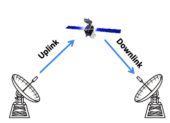
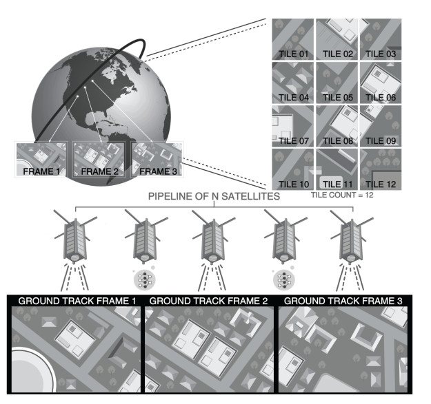
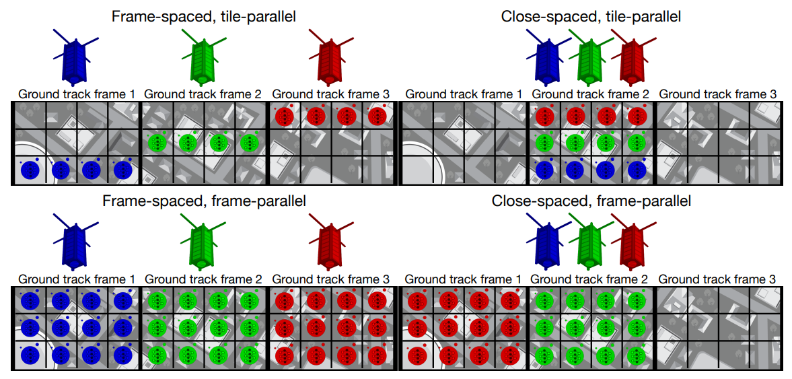

# Note

## 论文重点

+ 弯管架构（Bent-pipe architecture）：卫星用于传递信息的典型方式。 该模型将远程控制命令发送到轨道卫星，并将传感数据传送到地球。



​		局限性：受限于物理系统的配置，并且随着数量的增多，弯管架构可能会崩溃。

+ 现有系统在弯管架构下面临的挑战源于基本的物理限制。 地面站的地理位置和纳米卫星的轨道位置之间的时变关系限制了链路可用性，并可能导致高下行链路（downlink）延迟。 在现有系统中，间断可用的下行链路会导致数据收集和数据处理之间的高延迟（这些系统仅下行链路原始观测数据）。下行链路本身可能不可靠，容易产生丢包。另外，下行链路比特率的限制阻止了弯曲管道的扩展以适应大型星座的极端数据量，并产生了对不依赖通信的新系统架构的需求。

+ 可以将纳米卫星组成的星座作为一个分布式系统，构成一个计算管道，利用这些卫星自带的系统进行边缘计算。虽然这些边缘计算的速度比不上计算中心的速度。

  > 虽然从边缘访问云可以加速计算，但任何好处都取决于回程网络的可用性。

​		网络对于这种大体量的传感器已经成为了瓶颈，因为数据率已经超过了网络的最大带宽。采用边缘计算的方式，能够减轻对通信的依		赖，让系统变得**scalable**。

+ 正如许多云计算服务所使用的设备趋向于用普通的物理机来进行横向扩展，而不是采用极端高性能的物理机，对于卫星而言，比起造价昂贵的 `Monolithic`，`Nanosatellite` 更适合用于扩展整个系统。

  

+ `LEO` 即Low Earth Orbit，近地轨道。

+ `OEC` 通过处理轨道上的图像、仅下行链接感兴趣的图像以及丢弃或记录其余图像，减少了对大量地面站的需求。 例如，假设机器推理从 15 GB 的原始数据中识别出 0.75 GB 的感兴趣的数据，那么所有数据在 30 秒内以 200 Mbit/s 的速度下行。 每个地面站不是每转只服务 9 颗卫星，而是支持 185 颗卫星，一个由 1000 颗 OEC 卫星组成的星座只需要 6 个地面站。 

+ `GTF` 即Ground Track Frame，`CNP` 即Computational Nanosatellite Pipelines.

​		

​		上：轨道决定地面轨迹，即卫星经过的位置。 一条地面轨道可以分成一系列地面轨道框架。通常，每个帧在处理之前都会被平铺。 		底部：`CNP` 的插图。 卫星对地面轨道帧进行成像并执行处理，直到到达下一帧。

+ 
  + 一个`frame-spaced`，`tile-parallel` 的 `CNP` 将设备隔开一个 `GTF` 的距离。每个设备对每个 `GTF` 进行成像（只要有足够的能量)并处理一个瓦片子集。
  + 一个`frame-spaced`，`frame-parallel` 的 `CNP` 还将设备在距离上隔开一个 `GTF`。 每个设备对 `GTF` 的一个不同子集进行成像，并处理帧中的所有图块。 
  + 一个`close-spaced`，`tile-parallel` 的 `CNP` 将设备放置在距离很近的地方。每个设备对每个 `GTF` 进行成像并处理一个瓦片子集。
  + 一个`close-spaced`，`frame-parallel` 的 `CNP` 还将设备放置在距离很近的地方。 每个设备对 `GTF` 的一个不同子集进行成像，并处理帧中的所有图块。 

+ `cote` 通过轨道力学的分析模型、天体和地球坐标系的时间演化、通信比特率的物理界限以及收集和缓冲能量的离散时间模型，提供了对 `OEC` 系统的详细物理模拟， 传感、数据存储和计算。这些核心组件在两个应用程序中共享：`cote-sim` 和 `cote-lib`。`cote-sim` 支持 `OEC` 系统设计，而 `cote-lib` 支持边缘的动态在线自治。

  `cote-lib` 在 `OEC` 设备的后台连续运行，明确地模拟地面站的可用性。

  `cote-lib` 在给定输入功率和计算工作负载参数的情况下估计延迟和能量收集。 当 `OEC` 卫星收集图像时，它利用 `cote-lib` 来确定是在本地处理图像还是将原始数据传输到地面。 因此，`cote-lib` 使 `OEC` 卫星能够实时适应不断变化的轨道和功率条件； 对于高延迟的弯管地面控制，这种细粒度的适应是不可能的。

+ `cote` 的主要组成部分：

  + 时间：

    > cote represents dates and times with the ISO 8601 standard. To compare different points in the Gregorian calendar, cote converts each date and time to the equivalent Julian date.

  + 坐标系：

    > cote supports three coordinate frames: the Earth-centered, inertial (ECI) frame, the latitude, longitude, and height above the ellipsoid (LLH) frame, and the south, east, z (SEZ) frame.

  + 轨道力学：

    > cote uses the de facto standard simplified general perturbation model (SGP4) as its orbital mechanics engine.

  + 通信：

    > cote models the maximum achievable bitrate under received signal power for downlink, crosslink, and uplink channels

## 环境配置

根据论文末尾的链接我们能找到项目的地址：https://github.com/CMUAbstract/oec-asplos20-artifact。该项目的README中提供了详细的环境搭建步骤。但是可能因为我使用的是 ubuntu20.04，而项目使用的是 ubuntu18.04，在执行脚本 `./setup_dependencies.sh $HOME/sw` 下载 `gcc8.3.0` 的时候出错。不过重点是下载gcc，只要下载了正确版本的gcc就行，所以我尝试自己手动下载编译gcc，以下是我踩的一些坑。

以下是安装步骤（参考自https://www.cnblogs.com/dakewei/p/10737149.html）：

1. 获取源码

```bash
wget https://mirrors.ustc.edu.cn/gnu/gcc/gcc-8.3.0/gcc-8.3.0.tar.xz -P ~
tar xvf gcc-8.3.0.tar.xz -C ~
cd ~/gcc-8.3.0
```

2. 运行 download_prerequisites 脚本

```bash
./contrib/download_prerequisites
```

3. 创建编译目录

```bash
mkdir build-gcc-8.3.0
cd build-gcc-8.3.0
```

4. 配置（需要将username换成自己对应的用户名）

```bash
../configure --enable-checking=release --enable-languages=c,c++ --disable-multilib --prefix=/home/username/gcc
```

5. 编译（-j4代表用4个核，可以根据核数设置）

```bash
make -j4
```

6. 安装

```bash
make install
```

以上指令完成了gcc的基本安装，其中 `download_prerequisites` 脚本可以自动下载需要的依赖。如果某个依赖出现下载问题，可以使用下面的网址手动下载：

+ GMP：http://mirror.hust.edu.cn/gnu/gmp/gmp-6.1.2.tar.xz
+ MPFR4.0.2：http://mirror.hust.edu.cn/gnu/mpfr/mpfr-4.0.2.tar.xz
+ MPC1.1.0：http://mirror.hust.edu.cn/gnu/mpc/mpc-1.1.0.tar.gz

但是 `make` 的时候还是报了下面的错误：

```
../../../../gcc-8.3.0/libsanitizer/sanitizer_common/sanitizer_internal_defs.h:317:72: error: size of array 'assertion_failed__1152' is negative
     typedef char IMPL_PASTE(assertion_failed_##_, line)[2*(int)(pred)-1]
```

在 `stackoverflow` 上找到了相同的问题：https://stackoverflow.com/questions/62435946/building-gcc-8-3-makefile955-all-error-2

根据下面最高赞的回答，解决了该问题，编译成功。

> I think you need this patch: https://raw.githubusercontent.com/easybuilders/easybuild-easyconfigs/develop/easybuild/easyconfigs/g/GCCcore/GCCcore-9.2.0-fix-glibc-2.31-libsanitizer.patch - it'll apply to 8.3.0 fine

根据他提供的网址，将对应的文件进行修改，此时能够正确编译。

至此，gcc安装成功。

将gcc编译构建的结果（我这边指定在home/username/gcc这个目录中）放入到 `$HOME/sw/gcc-8.3.0-install` 中（因为之前按照他给的脚本去安装gcc会出错，所以这边相当于手动安装，然后将构建结果放入到他指定的目录下）。

此时，运行 `./run_csfp_sims.sh` 指令依旧会报错：`version 'GLIBCXX_3.4.26' not found (required by xxxxxx)`

这是动态链接库的问题，通过https://www.csdn.net/tags/NtTaUgwsMDQzMjItYmxvZwO0O0OO0O0O.html提供的方法成功解决（过程就是找到有 `GLIBCXX_3.4.26` 的动态链接库，然后将其复制一份到 `gcc-8.3.0-install/lib64` 目录下，改名为`libstdc++.so.6`）。

此时，均能运行成功。

## 运行

按照README中的指示运行对应的仿真即可，有很多种。每一种都在根目录的 `artifacts` 目录下对应一个目录。在这些目录中，都有一个名为 `source` 的目录，里面存放的是 **cmakelist** 和**源码**。

仿真是在后台跑的，可以用 `top` 指令查看情况。因为很占 cpu ，同一时间建议只跑一个。
