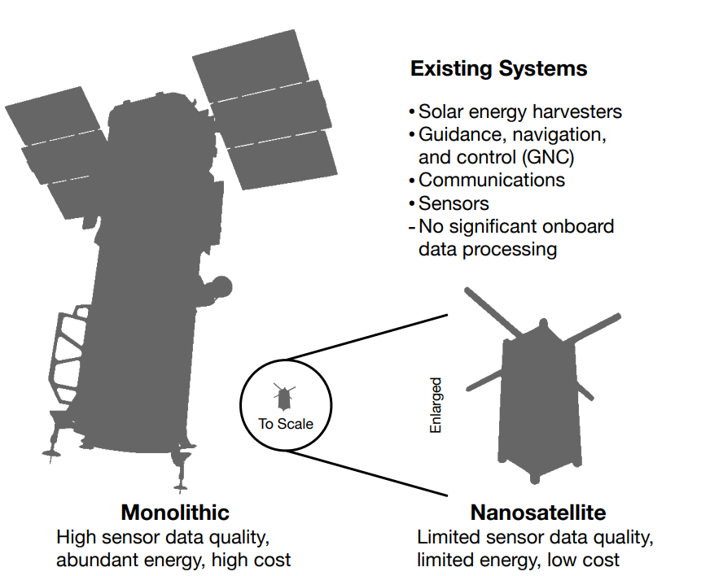
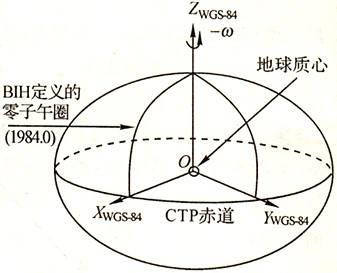
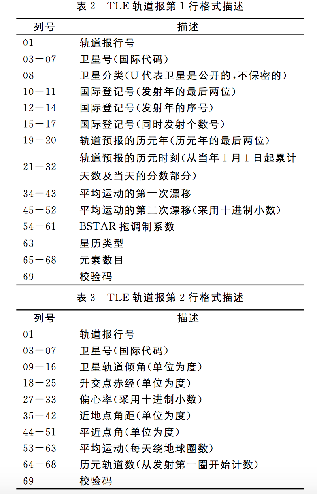

# Note

## 论文重点

+ 弯管架构（Bent-pipe architecture）：卫星用于传递信息的典型方式。 该模型将远程控制命令发送到轨道卫星，并将传感数据传送到地球。

    

    局限性：受限于物理系统的配置，并且随着数量的增多，弯管架构可能会崩溃。

+ 现有系统在弯管架构下面临的挑战源于基本的物理限制。 地面站的地理位置和纳米卫星的轨道位置之间的时变关系限制了链路可用性，并可能导致高下行链路（downlink）延迟。 在现有系统中，间断可用的下行链路会导致数据收集和数据处理之间的高延迟（这些系统仅下行链路原始观测数据）。下行链路本身可能不可靠，容易产生丢包。另外，下行链路比特率的限制阻止了弯曲管道的扩展以适应大型星座的极端数据量，并产生了对不依赖通信的新系统架构的需求。

+ 可以将纳米卫星组成的星座作为一个分布式系统，构成一个计算管道，利用这些卫星自带的系统进行边缘计算。虽然这些边缘计算的速度比不上计算中心的速度。

  > 虽然从边缘访问云可以加速计算，但任何好处都取决于回程网络的可用性。

  网络对于这种大体量的传感器已经成为了瓶颈，因为数据率已经超过了网络的最大带宽。采用边缘计算的方式，能够减轻对通信的依赖，让系统变得**scalable**。

+ 正如许多云计算服务所使用的设备趋向于用普通的物理机来进行横向扩展，而不是采用极端高性能的物理机，对于卫星而言，比起造价昂贵的 `Monolithic`，`Nanosatellite` 更适合用于扩展整个系统。

    

+ `LEO` 即Low Earth Orbit，近地轨道。

+ `OEC` 通过处理轨道上的图像、仅下行链接感兴趣的图像以及丢弃或记录其余图像，减少了对大量地面站的需求。 例如，假设机器推理从 15 GB 的原始数据中识别出 0.75 GB 的感兴趣的数据，那么所有数据在 30 秒内以 200 Mbit/s 的速度下行。 每个地面站不是每转只服务 9 颗卫星，而是支持 185 颗卫星，一个由 1000 颗 OEC 卫星组成的星座只需要 6 个地面站。 

+ `GTF` 即Ground Track Frame，`CNP` 即Computational Nanosatellite Pipelines.

    

    上：轨道决定地面轨迹，即卫星经过的位置。一条地面轨道可以分成一系列地面轨道框架。通常，每个帧在处理之前都会被平铺。底部：`CNP` 的插图。卫星对地面轨道帧进行成像并执行处理，直到到达下一帧。

+ 
  + 一个`frame-spaced`，`tile-parallel` 的 `CNP` 将设备隔开一个 `GTF` 的距离。每个设备对每个 `GTF` 进行成像（只要有足够的能量)并处理一个瓦片子集。
  + 一个`frame-spaced`，`frame-parallel` 的 `CNP` 还将设备在距离上隔开一个 `GTF`。 每个设备对 `GTF` 的一个不同子集进行成像，并处理帧中的所有图块。 
  + 一个`close-spaced`，`tile-parallel` 的 `CNP` 将设备放置在距离很近的地方。每个设备对每个 `GTF` 进行成像并处理一个瓦片子集。
  + 一个`close-spaced`，`frame-parallel` 的 `CNP` 还将设备放置在距离很近的地方。 每个设备对 `GTF` 的一个不同子集进行成像，并处理帧中的所有图块。 

+ `cote` 通过轨道力学的分析模型、天体和地球坐标系的时间演化、通信比特率的物理界限以及收集和缓冲能量的离散时间模型，提供了对 `OEC` 系统的详细物理模拟， 传感、数据存储和计算。这些核心组件在两个应用程序中共享：`cote-sim` 和 `cote-lib`。`cote-sim` 支持 `OEC` 系统设计，而 `cote-lib` 支持边缘的动态在线自治。

  `cote-lib` 在 `OEC` 设备的后台连续运行，明确地模拟地面站的可用性。

  `cote-lib` 在给定输入功率和计算工作负载参数的情况下估计延迟和能量收集。 当 `OEC` 卫星收集图像时，它利用 `cote-lib` 来确定是在本地处理图像还是将原始数据传输到地面。 因此，`cote-lib` 使 `OEC` 卫星能够实时适应不断变化的轨道和功率条件； 对于高延迟的弯管地面控制，这种细粒度的适应是不可能的。

+ `cote` 的主要组成部分：

  + 时间：

    > cote represents dates and times with the ISO 8601 standard. To compare different points in the Gregorian calendar, cote converts each date and time to the equivalent Julian date.

  + 坐标系：

    > cote supports three coordinate frames: the Earth-centered, inertial (ECI) frame, the latitude, longitude, and height above the ellipsoid (LLH) frame, and the south, east, z (SEZ) frame.

  + 轨道力学：

    > cote uses the de facto standard simplified general perturbation model (SGP4) as its orbital mechanics engine.

  + 通信：

    > cote models the maximum achievable bitrate under received signal power for downlink, crosslink, and uplink channels

### ECI
`ECI` 坐标系即地心惯性坐标系。其用 XYZ 表示，原点为地球中心，X 轴值向春分点，即黄道平面（地球绕太阳公转的平面）与赤道的交点。

### HAE 
`HAE` 即 `Height Above Ellipsoid`。

### WGS-84

`WGS-84` 坐标系（`World Geodetic System一1984 Coordinate System`）是一种国际上采用的地心坐标系。
坐标原点为地球质心，其地心空间直角坐标系的 Z 轴指向 `BIH`（国际时间服务机构）1984.0 定义的协议地球极（`CTP`）方向，X 轴指向 `BIH` 1984.0 的零子午面和 `CTP` 赤道的交点，Y 轴与 Z 轴、X 轴垂直构成右手坐标系，
称为 **1984年世界大地坐标系统**。



### TLE格式和SGP4模型

`TLE` 即 `TLE，Two-Line Orbital Element`，意为两行轨道数据。`TLE` 
主要参数项包括**平均角速度**，**偏心率**，**轨道倾角**，**近地点辐角**，**升交点赤经**，**平近点角**，**平均角速度的一阶导数**和**归一化大气阻尼调制系数（bstar）**。

以下是一个TLE文件的实例：
```
flock 3k 3
1 43892U 18111S   19193.68092670  .00002615  00000-0  10917-3 0  9994
2 43892  97.2888  98.1666 0022265 273.4726  86.3966 15.24309684 30096
```



可以通过 http://celestrak.com/NORAD/elements/ 或 https://www.space-track.org/auth/login 这两个网址获取卫星的 `TLE` 数据。

TLE轨道报计算卫星轨道需要用到 `NORAD` 开发的 `SGP4/SDP4` 模型。
`SGP4` 模型是由 `Ken Cranford` 在1970年开发的，用于近地卫星。
该模型是对 `Lane` 和 `Cranford` 广泛解析理论的简化。
这些模型需考虑到地球非球形引力、日月引力、太阳辐射压及大气阻力等摄动力的影响。
`SGP4(Simplified General Perturbations)` 即简化常规摄动模型，可以应用于轨道周期小于225分钟的近地球物体。 
`SDP4 (Simplified Deep Space Perturbations)` 即简化深空摄动模型，应用于远离地球或者轨道周期大于225分钟的物体。 
如果将TLE轨道报代入 `SGP4` 模型，可以成功地对轨道周期小于225分的空间目标进行预测，求解出目标物体在任意时刻的位置和速度。

## 论文中未考虑的内容
+ 卫星间的通信问题。该论文主要侧重点在于对于能量和下行链路的模拟，但是没有考虑到星间通信。

## 环境配置

根据论文末尾的链接我们能找到项目的地址：https://github.com/CMUAbstract/oec-asplos20-artifact

该项目的README中提供了详细的环境搭建步骤。但是可能因为我使用的是 ubuntu20.04，而项目使用的是 ubuntu18.04，在执行脚本 `./setup_dependencies.sh $HOME/sw` 下载 `gcc8.3.0` 的时候出错。不过重点是下载gcc，只要下载了正确版本的gcc就行，所以我尝试自己手动下载编译gcc，以下是我踩的一些坑。

以下是安装步骤（参考自https://www.cnblogs.com/dakewei/p/10737149.html）：

1. 获取源码

```bash
wget https://mirrors.ustc.edu.cn/gnu/gcc/gcc-8.3.0/gcc-8.3.0.tar.xz -P ~
tar xvf gcc-8.3.0.tar.xz -C ~
cd ~/gcc-8.3.0
```

2. 运行 download_prerequisites 脚本

```bash
./contrib/download_prerequisites
```

3. 创建编译目录

```bash
mkdir build-gcc-8.3.0
cd build-gcc-8.3.0
```

4. 配置（需要将username换成自己对应的用户名）

```bash
../configure --enable-checking=release --enable-languages=c,c++ --disable-multilib --prefix=/home/username/gcc
```

5. 编译（-j4代表用4个核，可以根据核数设置）

```bash
make -j4
```

6. 安装

```bash
make install
```

以上指令完成了gcc的基本安装，其中 `download_prerequisites` 脚本可以自动下载需要的依赖。如果某个依赖出现下载问题，可以使用下面的网址手动下载：

+ GMP：http://mirror.hust.edu.cn/gnu/gmp/gmp-6.1.2.tar.xz
+ MPFR4.0.2：http://mirror.hust.edu.cn/gnu/mpfr/mpfr-4.0.2.tar.xz
+ MPC1.1.0：http://mirror.hust.edu.cn/gnu/mpc/mpc-1.1.0.tar.gz

但是 `make` 的时候还是报了下面的错误：

```
../../../../gcc-8.3.0/libsanitizer/sanitizer_common/sanitizer_internal_defs.h:317:72: error: size of array 'assertion_failed__1152' is negative
     typedef char IMPL_PASTE(assertion_failed_##_, line)[2*(int)(pred)-1]
```

在 `stackoverflow` 上找到了相同的问题：https://stackoverflow.com/questions/62435946/building-gcc-8-3-makefile955-all-error-2

根据下面最高赞的回答，解决了该问题，编译成功。

> I think you need this patch: https://raw.githubusercontent.com/easybuilders/easybuild-easyconfigs/develop/easybuild/easyconfigs/g/GCCcore/GCCcore-9.2.0-fix-glibc-2.31-libsanitizer.patch - it'll apply to 8.3.0 fine

根据他提供的网址，将对应的文件进行修改，此时能够正确编译。

至此，gcc安装成功。

将gcc编译构建的结果（我这边指定在home/username/gcc这个目录中）放入到 `$HOME/sw/gcc-8.3.0-install` 中（因为之前按照他给的脚本去安装gcc会出错，所以这边相当于手动安装，然后将构建结果放入到他指定的目录下）。

此时，运行 `./run_csfp_sims.sh` 指令依旧会报错：`version 'GLIBCXX_3.4.26' not found (required by xxxxxx)`

这是动态链接库的问题，通过https://www.csdn.net/tags/NtTaUgwsMDQzMjItYmxvZwO0O0OO0O0O.html 

提供的方法成功解决（过程就是找到有 `GLIBCXX_3.4.26` 的动态链接库，然后将其复制一份到 `gcc-8.3.0-install/lib64` 目录下，改名为`libstdc++.so.6`）。

此时，均能运行成功。

## 运行

按照README中的指示运行对应的仿真即可，有很多种。每一种都在根目录的 `artifacts` 目录下对应一个目录。在这些目录中，都有一个名为 `source` 的目录，里面存放的是 **cmakelist** 和**源码**。

仿真是在后台跑的，可以用 `top` 指令查看情况。因为很占 cpu ，同一时间建议只跑一个。

仿真分为两个部分，第一个部分是对于能源的仿真，可以查看 `csfp-base` 中的相关代码，没有涉及任何通信的相关代码，个人认为这边仿真的是任务已经被分发到卫星 pipeline 上进行边缘计算的场景。 
这一部分主要通过对太阳能电池（`satsim::SimpleSolarCell`），超级电容（`satsim::Capacitor`），以及几个能源消耗设备（`Energy consumer`）： `satsim::JetsonTX2`，
`satsim::ChameleonImager` 等（前者负责机器学习相关计算，后者负责摄影）。上面提及的这些设备都继承了 `ISim` 这个抽象类。这个抽象类有个方法叫做 
`update`，是仿真逻辑的关键所在。

流程图：



另一部分则是对于上行链路和下行链路等通信相关内容进行仿真。仿真会先读取解析实现准备好的 `datetime`，传感器参数，`TLE` 数据文件等等，以准备进行仿真。
在进行仿真的时候，会将TLE中的数据代入 `SGP4` 模型，以获取卫星当前的 ECI 坐标系坐标。
这个坐标会被用于计算该卫星相对于地面站的仰角，如果大于等于 10度，
那么就会被认定为是可见的。

以 `sim-cs` 为例，需要跑 sim-cs/scripts/run_cs_scenarios.sh 这个脚本。
在这个脚本中，首先需要通过 `prep_cs_scenarios.sh` 生成仿真所需要的所有的文件和目录。我们先关注 `prep_cs_scenarios.sh` 这个脚本的逻辑。

首先，该脚本创建 data 和 logs 两个目录，用于存放仿真所需要的数据以及仿真的日志文件。接着，枚举三种卫星，也就是 `planet 鸽群卫星`，`spacex 星链卫星` 和 
`spire 卫星`。 然后枚举地面站的数量，在每一轮枚举中，都会有三种 `gnd_config`：`eq`（赤道），`ns`（南北极）以及 `un`（大学）。我们对三种情况逐个分析：
我们假设当前枚举的轨道为 `planet`，以便进行后续的说明。

+ `eq`，`equatorial ground stations`：
  
    首先，调用 `generate_data_directories.sh` 这个脚本，这个脚本的功能十分简单，就是在提供的根目录下创建仿真所需要的目录。后面两个配置都会
    调用这个脚本。
    
    ```shell script
    cp ../../sim-common/dt/date-time.dat ../data/$orbit-$gnd_config-$gnd_count/dt/
    cp ../../sim-common/sat/$orbit.tle ../data/$orbit-$gnd_config-$gnd_count/sat/
    cp ../../sim-common/sat/cs-$orbit.dat ../data/$orbit-$gnd_config-$gnd_count/sat/
    cp ../../sim-common/sensor/sensor.dat ../data/$orbit-$gnd_config-$gnd_count/sensor/
    ```
    此处四行代码旨在将仿真所需的 `datetime`，`TLE` 文件，轨道卫星时间间隔以及传感器数据复制到对应的目录下，以便仿真读取（在 closed-spaced.cpp 中有很多读取文件的操作）和使用。

    接下来看这一行指令：
    ```shell script
    python3 populate_gnd_ring.py 0.0 0.0 $((10#$gnd_count)) 0 ../data/$orbit-$gnd_config-$gnd_count/gnd/
    ```
    我们现在来关注一下这个 `populate_gnd_ring.py` 脚本的逻辑：
    
    首先，看名字就知道，这个脚本应该是用于生成环形地面站（所对应的文件）的。该脚本需要以下参数：
    + `lat`：所有地面站的维度；
    + `lon`：第一个地面站的经度（因为是环形，所以可以由此生成其他地面站的经度）；
    + `n`：地面站的数量；
    + `id0`：第一个地面站的id，后续地面站的id将会依次递增；
    + `dst`：存放输出文件的目录路径。
    
    该脚本会输出 `n` 个 `CSV` 文件，格式为 `[id, lat(deg), lon(deg), hae(km)]`。每个地面站都对应一个 `CSV` 文件。
    这些文件的命名格式为：`ground-station-000...id.dat`，`id` 为地面站的 `id`， 前面会填充若干个 0，以达到 10 位。
    
    ```shell script
    python3 populate_rx.py ../data/$orbit-$gnd_config-$gnd_count/gnd/ dat 44.1 8.15e9 20.0e6 ../data/$orbit-$gnd_config-$gnd_count/rx-gnd/
    python3 populate_rx.py ../data/$orbit-$gnd_config-$gnd_count/sat/ tle 1.5 436.5e6 60.0e3 ../data/$orbit-$gnd_config-$gnd_count/rx-sat/
    ```
    接着，关注 `populate_rx.py` 这个脚本。这个脚本的作用就是生成和通信 `rx` 相关的文件。该脚本需要以下的参数：
    + `src`：设备所处的目录（注意这边地面站和卫星统称为 `device`）；
    + `ext`：需要读取的文件的拓展名（例如 `.dat`）；
    + `max_gain_db`：最大信息增益；
    + `center_frequency_hz`：中心频率；
    + `bandwidth_hz`：带宽；
    + `dst`：存放输出文件的目录路径。
    
    在给这个脚本传递参数的时候，实际上使用到了前面生成的地面站数据和卫星数据。该脚本会读取指定拓展名的文件，并生成同等数量的 `CSV` 文件，文件的格式为：
    `[id, max_gain(dB), center_frequency(Hz), bandwidth(Hz)]`。文件名格式为：`rx-000...id.dat`，`id` 为设备的 `id`， 前面会填充若干个 0，以达到 10 位。
    
    在给这个脚本传参数的时候，`max_gain_db`，`center_frequency_hz`，`bandwidth_hz` 这三个参数会被用于对通信的仿真。在上面展示的脚本中，这三个参数是直接被指定的，
    而没有读取外部配置文件。如果需要对通信设备进行修改，请注意这块内容。
    
    ```shell script
    python3 populate_tx.py ../data/$orbit-$gnd_config-$gnd_count/gnd/ dat 10.0 -1.0 15.5 436.5e6 60.0e3 ../data/$orbit-$gnd_config-$gnd_count/tx-gnd/
    python3 populate_tx.py ../data/$orbit-$gnd_config-$gnd_count/sat/ tle 2.0 -1.0 6.0 8.15e9 20.0e6 ../data/$orbit-$gnd_config-$gnd_count/tx-sat/
    ```
    对于 `populate_tx.py` 脚本，和前面的 rx 是类似的。但是参数更多一点：
    + `src`：设备所处的目录（注意这边地面站和卫星统称为 `device`）；
    + `ext`：需要读取的文件的拓展名（例如 `.dat`）；
    + `power_w`：传输功率；
    + `line_loss_db`：线路损耗；
    + `max_gain_db`：最大增益；
    + `center_frequency_hz`：中心频率；
    + `bandwidth_hz`：带宽；
    + `dst`：存放输出文件的目录路径。
    
    参数传递和生成的文件和前面的 rx 都是类似的，此处不再赘述。

+ `ns`，`north/south polar ground stations`：
    与前面的 `eq` 基本类似，但是注意这两行指令：
    ```shell script
    python3 populate_gnd_ring.py  87.0 0.0 $(( $((10#$gnd_count))/2 )) 90000 ../data/$orbit-$gnd_config-$gnd_count/gnd/
    python3 populate_gnd_ring.py -87.0 0.0 $(( $((10#$gnd_count))/2 )) 91000 ../data/$orbit-$gnd_config-$gnd_count/gnd/
    ```
    这边是两极的地面站，所以使用的维度为 ±87.0度，且平分数量。`id` 也有所不同。
    
+ `un`，`university ground stations`：
    与前两个几乎一致，但是地面站的经纬度信息不是通过 `populate_gnd_ring` 脚本生成的。
    ```shell script
    python3 populate_gnd_unis.py $((10#$gnd_count)) ../../sim-common/unis/ ../data/$orbit-$gnd_config-$gnd_count/gnd/
    ```
    因为这边使用的是散布在各个地区的大学的地面站，所以使用
    了 `populate_gnd_unis.py` 脚本生成地面站经纬度信息的 `CSV` 文件。
    
    现在我们着重关注这个脚本。该脚本需要以下参数：
    + `n`：需要创建的大学地面站的数量；
    + `src`：包含 `unis.dat` 文件的目录；
    + `dst`：存放输出文件的目录路径。
    
    `unis.dat` 文件中包含各个大学地面站的 `id`，名称，经度和纬度。脚本中稳定会解析读取 `CMU` 的地面站，然后根据给定的 `n` 随机选定剩下的
    `n-1` 个大学地面站。生成的文件内容和名称和前面提及的都是类似的。
    
流程图：



我们可以按照最外部根目录下 README 文件中的指示，分析日志文件并作图。关于解析日志文件和绘制相应的图像，请着重查看以下三个脚本：
+ scripts/csfp_coverage.py
+ scripts/csfp_latency.py
+ scripts/collate_downlink_deficit.py

分别对应论文附录中提及的三个 Metrics：

>    Metrics: Percent data not downlinked per revolution; average system ground track frame latency; fraction of ground track processed per revolution (coverage)

+ 对于 `csfp_coverage.py`：
  
    该脚本会简单地统计 `event-chamgr-*-readout-gtf-*.csv` 文件的数量，除以 `gtf_count` 以获取覆盖率。 该脚本会输出一个名为 `csfp-coverage.csv` 的
    文件，其中包含了不同 `pipeline depth` 下的覆盖率。
   
+ 对于 `csfp_latency.py`：

    该脚本会读取 `event-jetson-*-begin-gtf-*.csv` 以及 `event-jetson-*-complete-gtf-*.csv` 文件中的事件时间，将其作差，以获取从开始 `gtf` 任务
    到完成所需的时延。该脚本会输出一个名为 `csfp-latency.csv` 的文件，其中包含了不同 `pipeline depth` 下的平均时延和标准差。
    
+ 对于 `collate_downlink_deficit.py`：
  
    该脚本计算的是下行链路数据量的赤字。在 `close-spaced.cpp` 中有这一段代码：
    ```c++
    if(downlinks.size()==0) {  
        log.meas(
            comsim::LogLevel::INFO,
            dateTime.toString(),
            std::string("downlink-MB"),
            std::to_string(0.0)
        );
    } else {
        for(size_t i=0; i<downlinks.size(); i++) {
            log.meas(
                comsim::LogLevel::INFO,
                dateTime.toString(),
                std::string("downlink-MB"),
                std::to_string(
                    (1.0*static_cast<double>(downlinks.at(i).getBitsPerSec())/8.0)/1.0e6
                )
            );  
        }
    }
    ```
    这段代码会将实时下行链路的数据量记录到日志文件中。当无下行链路的时候，各项数据均为 0。`getBitsPerSec` 函数返回的是每秒的数据量，默认为
    理论上的最大数据量。
    
    ```c++
    if(distance>=satId2Threshold[LEAD_SAT_ID]) {
        log.evnt(
            comsim::LogLevel::INFO,currDateTime.toString(),"trigger-time"
        );
    }
    ```
    当距离大于阈值的时候，会触发 `sense event`，并将其记录到日志文件。 这里的 `sense event` 的触发就意味着需要对一个 `gtf` 进行采样。
    
    在 `collate_downlink_deficit.py` 脚本中，会通过这两种日志文件计算 `downlink deficit`，其实也就是还欠地面站多少百分比的数据。